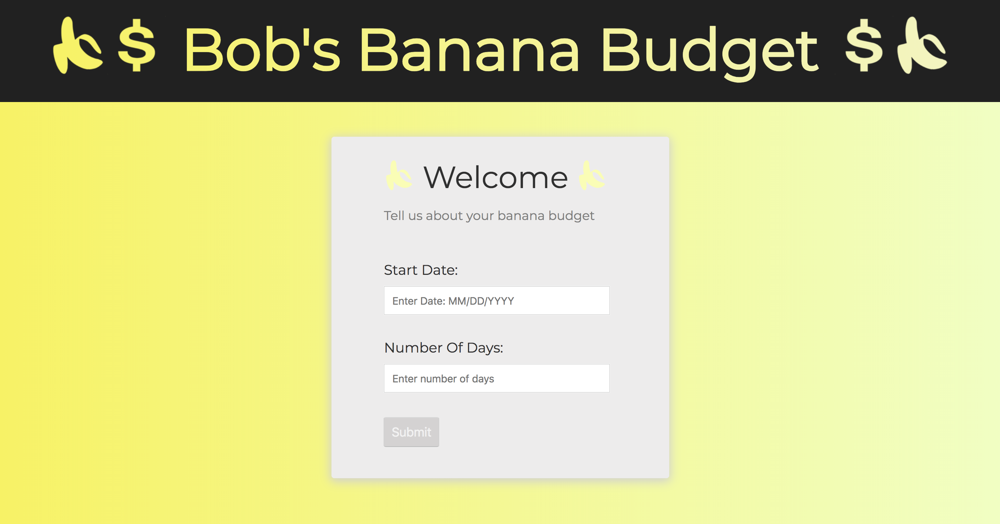
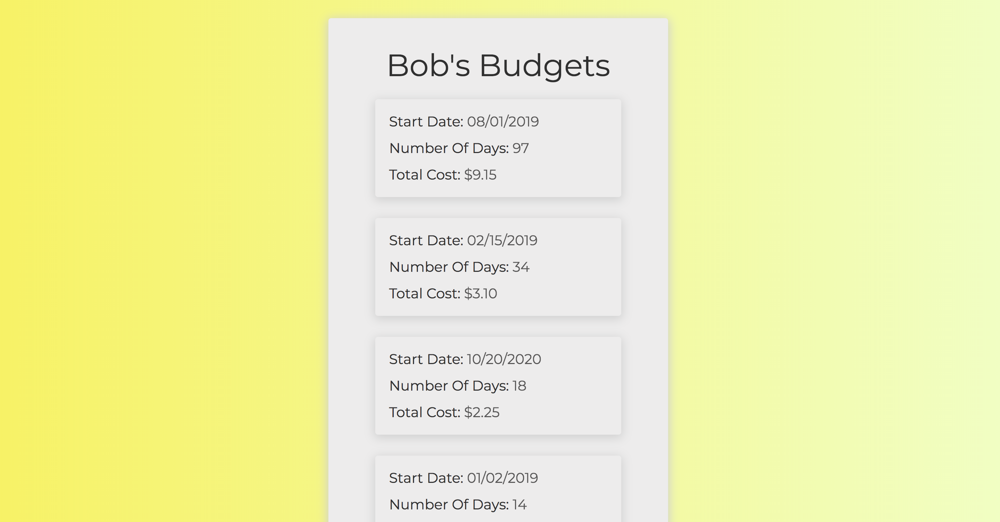
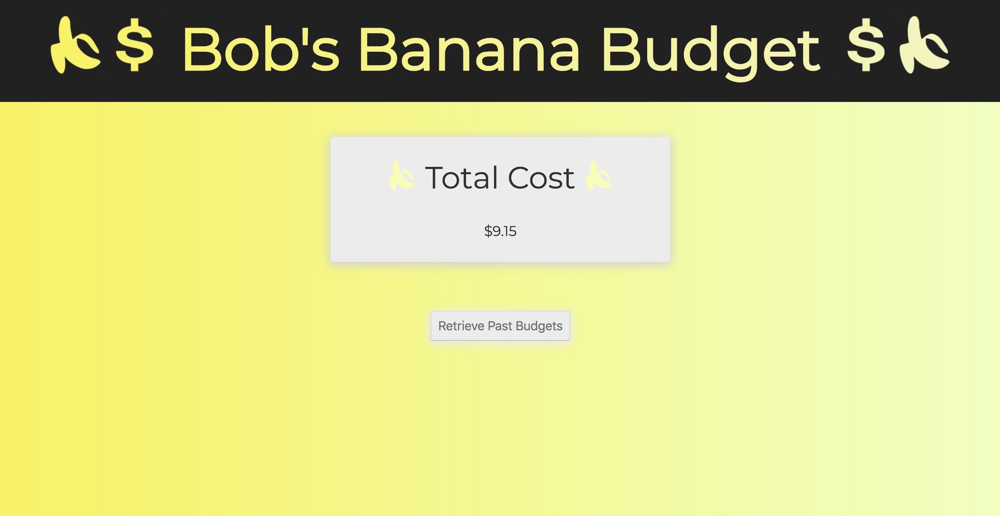

# Banana Budget


Banana Budget is a tool that helps Bob calculate his banana budget. 



## Installation

**1.** Clone or Download the repository.
```
git clone https://github.com/davemarquess/Banana-Budget.git
```

**2.** Open the repository, go to your terminal and run the following commands to download all required libraries:
```
npm install
npm run server
npm run start
```

##


##

